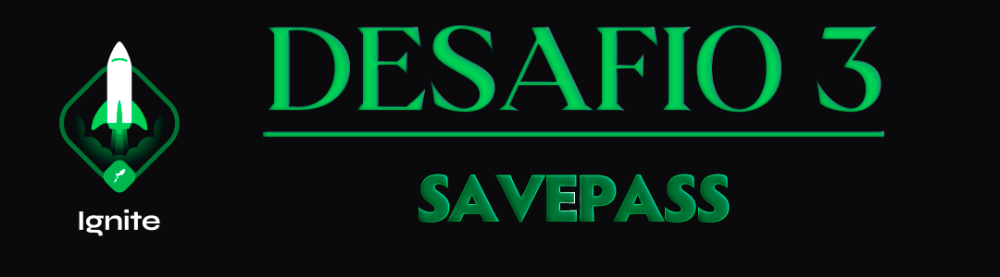

<div align="center">
  
</div>

<h1 align="center"> RocketSeat 🚀 Ignite ReactJS 📱</h1>

<p align="center">
  <a href="https://rocketseat.com.br">
    
  </a>
  
  
  
</p>

## 🧠 Detalhes do desafio

Nesse desafio, você irá implementar uma aplicação de gerenciamento de senhas: SavePass.

Essa aplicação possui duas telas, sendo a primeira delas uma listagem das senhas salvas e a segunda a tela de cadastro de novos logins.

## ⚙️ Instalação do projeto

## Clone este repositório e acesse o diretório

```sh
$ git clone git@github.com:augustohermes/desafio03-savepass.git && cd desafio03-savepass
```

## Instale as dependências necessárias

```sh
$ yarn
```

## Rodando o projeto

```sh
$ yarn start
```

## Abra outro terminal e inicie o projeto no emulador

```ssh
$ npx react-native run-android
```

<br>

Feito com ❤️ por [Augusto Hermes](https://github.com/augustohermes) 👋.
